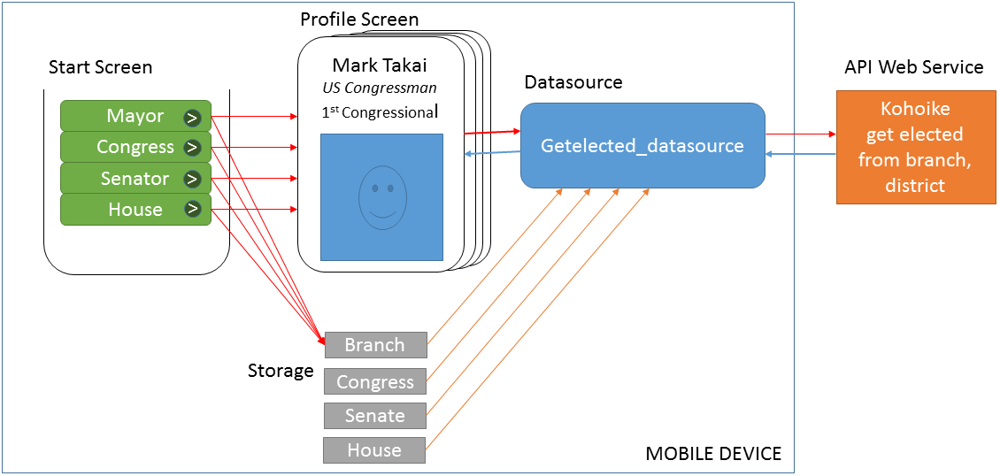

Made using Appery in ics321, this app takes the geocoordinates of the user, returns the address then when returns voting information of the user including Mayor, Congressman State Senator and State House Representator.

Appery is a mobile app developement envirement that allows its users to create and devolpe apps in a simple and easy to learn way.  Even though my subscription with Appery has ended, developing this simple geolocation app has allowed me to better understand the though process that goes behind recieving, gathering and processing data even in simple geolocation apps such as this
