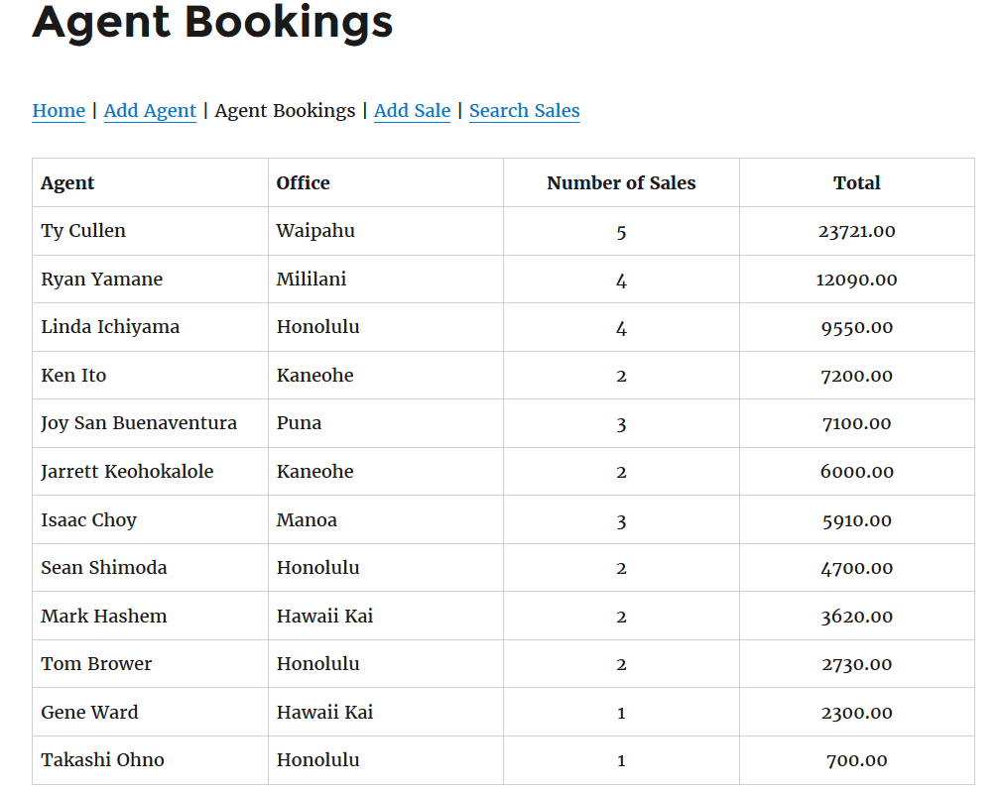

In 2016 in a class about data storage, I created a fictitious database of a travel agency and it's sales to better understand how to manage and display data.

The database required knowledge of a front-end user friendly interface to display the data and a backend database management system.  I used basic html in wordpress and sql statements in phpmyadmin to accomplish this.
